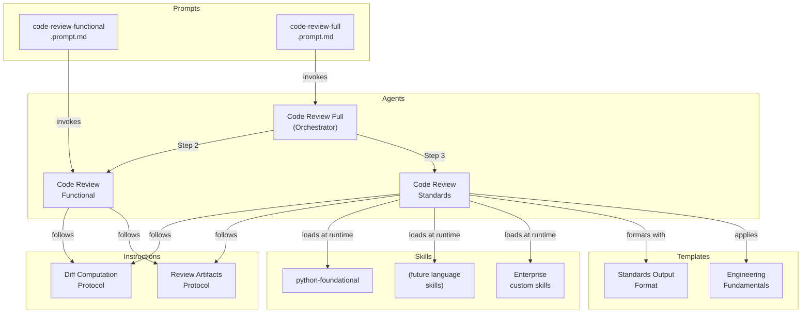
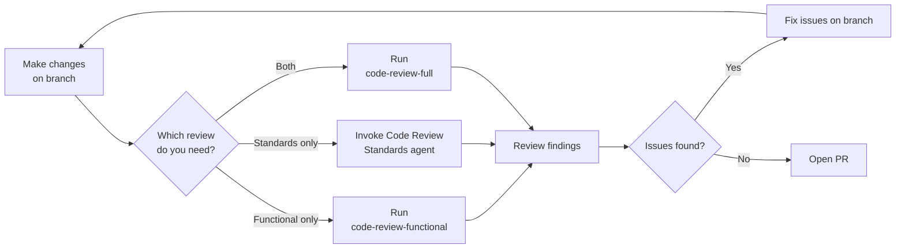

The code review system provides two complementary review passes that run before you open a pull request. A functional review catches logic errors, edge cases, and error handling gaps. A standards review enforces project-defined coding conventions through dynamically loaded skills. An orchestrator agent combines both into a single merged report.

> Most review feedback arrives after a PR is already open, when context switching and rework costs are highest. Running these agents on a local branch before pushing catches issues while the code is still fresh.

## Why Pre-PR Code Review?

| Benefit                       | Description                                                                                |
|-------------------------------|--------------------------------------------------------------------------------------------|
| Earlier defect detection      | Catches functional bugs on the branch, before reviewers spend time on a PR                 |
| Consistent standards coverage | Every diff gets the same skill-based analysis regardless of which reviewer picks up the PR |
| Extensible language support   | Teams add their own skills without modifying the review agents                             |
| Actionable output             | Every finding includes file paths, line numbers, current code, and a suggested fix         |

> [!TIP]
> New to hve-core code review? Start with the [functional review prompt](#functional-review) on your current branch to see the output format, then move to the [full orchestrated review](#full-orchestrated-review) once you are comfortable with the workflow.

## Architecture



The orchestrator computes the diff once and passes it to both subagents. Each subagent produces findings independently, and the orchestrator merges them into a single deduplicated report.

## The Three Agents

### Code Review Functional

Analyzes branch diffs for functional correctness across five focus areas:

| Focus Area     | What It Catches                                                                   |
|----------------|-----------------------------------------------------------------------------------|
| Logic          | Incorrect control flow, wrong boolean conditions, off-by-one errors               |
| Edge Cases     | Unhandled boundaries, missing null checks, empty collection handling              |
| Error Handling | Uncaught exceptions, swallowed errors, resource cleanup gaps                      |
| Concurrency    | Race conditions, deadlock potential, shared mutable state without synchronization |
| Contract       | API misuse, type mismatches at boundaries, violated preconditions                 |

Findings are severity-ordered (Critical, High, Medium, Low) with concrete code fixes. The agent includes false positive mitigation filters to keep noise low.

### Code Review Standards

Enforces project-defined coding standards through dynamically loaded skills. The agent is language-agnostic: it scans the workspace for `**/SKILL.md` files, matches them against the languages in the diff, and loads up to 8 relevant skills per review.

Skills provide the domain-specific checklists. The standards agent provides the review protocol, output format, and verdict logic. See [Language Skills](language-skills.md) for details on the built-in skills and how to create your own.

### Code Review Full (Orchestrator)

Runs both agents in sequence and produces a merged report:

1. Computes the diff once using the shared [diff computation protocol](../../contributing/instructions.md)
2. Invokes Code Review Functional with the diff
3. Invokes Code Review Standards with the diff (and optional story reference)
4. Merges findings, deduplicates overlaps, and applies the stricter verdict

The merged report includes severity-tagged findings from both sources, a unified changed files table, combined testing recommendations, and acceptance criteria coverage when a story reference is provided.

## Usage Flow



### Functional Review

Run the functional review prompt from the Copilot Chat panel:

```text
/code-review-functional
```

Optionally specify a base branch:

```text
/code-review-functional baseBranch=origin/develop
```

Defaults to `origin/main` when no base branch is specified.

### Standards Review

The standards review does not have a standalone prompt. Invoke the Code Review Standards agent directly from the Copilot Chat panel and describe what you want reviewed. The agent detects the diff automatically using the diff computation protocol.

### Full Orchestrated Review

Run both reviews in a single pass:

```text
/code-review-full
```

Pass a work item reference to enable acceptance criteria coverage:

```text
/code-review-full story=AB#456
```

The orchestrator passes the story reference to the standards subagent, which includes an Acceptance Criteria Coverage table in its report.

## Review Output

Both agents produce severity-ordered findings. Each finding includes:

* A descriptive title and severity level (Critical, High, Medium, Low)
* The file path and line range where the issue appears
* The current code from the diff that has the issue
* A suggested fix with replacement code
* The category and (for standards findings) the skill that surfaced the finding

### Verdict Scale

| Condition                     | Verdict               |
|-------------------------------|-----------------------|
| Any Critical or High findings | Request changes       |
| Only Medium or Low findings   | Approve with comments |
| No findings                   | Approve               |

The orchestrator uses the stricter verdict when merging: if either subagent would request changes, the merged report requests changes.

### Artifact Persistence

Review artifacts are saved to `.copilot-tracking/reviews/code-reviews/{branch-slug}/` with two files:

* `review.md`: the full review report in the standards output format
* `metadata.json`: a machine-readable summary for automation

The `metadata.json` file contains fields that CI pipelines, pre-commit hooks, and custom scripts can consume:

```json
{
  "schema_version": "1",
  "branch": "feat/my-feature",
  "head_commit": "abc123...",
  "reviewed_at": "2026-03-28T15:30:00Z",
  "verdict": "request_changes",
  "files_changed": ["src/main.py", "src/utils.py"],
  "findings_count": {
    "critical": 0,
    "high": 2,
    "medium": 1,
    "low": 0
  },
  "reviewer": "code-review-full"
}
```

The `verdict` field holds one of three values: `approve`, `approve_with_comments`, or `request_changes`. A pre-commit hook can read this file and block commits when the verdict is `request_changes`, ensuring review findings are addressed before code leaves the local branch. For example:

```bash
verdict=$(jq -r '.verdict' .copilot-tracking/reviews/code-reviews/*/metadata.json 2>/dev/null)
if [ "$verdict" = "request_changes" ]; then
  echo "Code review requires changes. Fix findings before committing."
  exit 1
fi
```

## What You Need

| Requirement         | Details                                                       |
|---------------------|---------------------------------------------------------------|
| VS Code + Copilot   | GitHub Copilot Chat with agent mode enabled                   |
| Git branch          | A local branch with commits ahead of the base branch          |
| hve-core collection | The `coding-standards` or `hve-core-all` collection installed |

The agents work with any programming language. Standards enforcement requires skills that match the languages in your diff. If no matching skills are found, the standards agent notes the gap and restricts its verdict.

## Extending with Custom Skills

The standards agent discovers skills dynamically at review time. You extend coverage by adding `SKILL.md` files to your repository without modifying the agent itself. See [Language Skills](language-skills.md) for the full guide on built-in skills, skill stacking, and authoring enterprise-specific standards.

<!-- markdownlint-disable MD036 -->
*🤖 Crafted with precision by ✨Copilot following brilliant human instruction,
then carefully refined by our team of discerning human reviewers.*
<!-- markdownlint-enable MD036 -->
